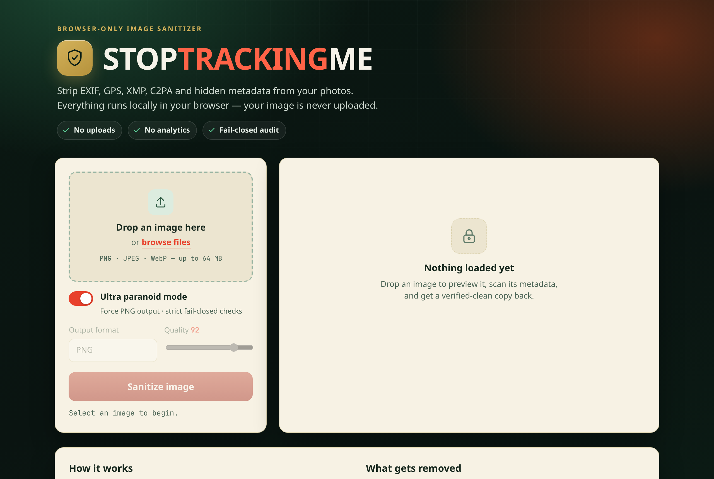
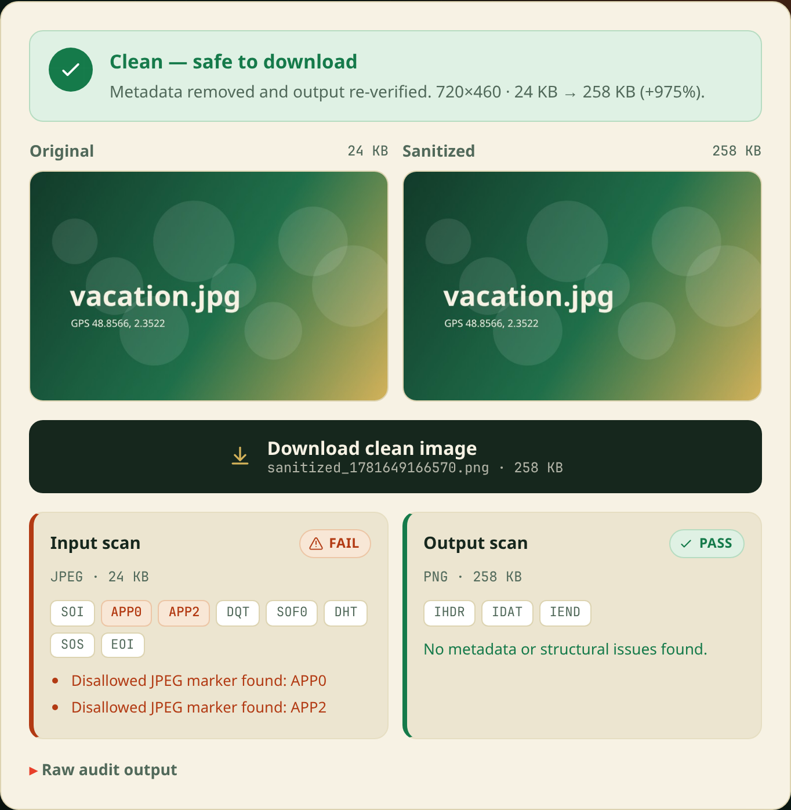

# STOPTRACKINGME

**Strip the tracking out of your photos — in your browser, before you share them.**

Photos carry more than pixels. EXIF timestamps, GPS coordinates, camera serials, editing
history, and content-credential signatures all ride along inside the file. STOPTRACKINGME
removes them, then **proves** the result is clean before it lets you download.

Everything runs locally. No uploads, no accounts, no servers. Your image never leaves the tab.



## Why it's different

Most "metadata removers" delete what they recognize and hand you the file. STOPTRACKINGME is
**fail-closed**: it re-encodes a fresh image from raw pixels, strips every non-essential
chunk, then **re-audits the output bytes**. If anything questionable survives, the download is
blocked — you never get a file that wasn't verified.

- **No uploads.** All processing happens in a Web Worker on your machine.
- **No network.** The production build ships a Content-Security-Policy that blocks every
  outbound connection.
- **Fail-closed.** Output is released only after it passes a strict audit.
- **Honest about limits.** It tells you exactly what it removed — and what it can't.



## How it works

1. Drop or pick a PNG, JPEG, or WebP.
2. The image is decoded to raw pixels — no original bytes survive.
3. A fresh file is re-encoded through audited WASM codecs.
4. Format-specific stripping removes every non-essential chunk and marker.
5. The output is re-scanned. If it isn't provably clean, download is refused.
6. You download a verified-clean copy.

The input scan reporting **FAIL** is normal — it's flagging the metadata in your *original*.
Only the **output** scan decides whether the download is allowed.

## What gets removed

| Format | Kept | Removed |
|--------|------|---------|
| **PNG**  | `IHDR`, `PLTE`, `IDAT`, `IEND`, `tRNS` | `tEXt`, `zTXt`, `iTXt`, `eXIf`, `iCCP`, and all unknown chunks |
| **JPEG** | image & structural segments | `APP0`–`APP15`, `COM` (EXIF, XMP, JFIF, comments) |
| **WebP** | `VP8 `, `VP8L`, `VP8X`, `ALPH` | `EXIF`, `XMP `, `ICCP`, animation chunks |

This covers EXIF (including GPS), XMP/IPTC, JPEG app/comment markers, PNG text and private
chunks, WebP metadata chunks, and C2PA / content-credential provenance signatures.

## Ultra Paranoid mode (default on)

Forces PNG output, disables lossy controls, and applies the strictest checks. PNG is a simpler
container with fewer metadata edge-cases, so the fail-closed audit can be more certain. PNG is
lossless, so the cleaned file is sometimes *larger* than the original — that's expected.

## What it can't do

This is metadata and provenance removal, not magic. It **cannot** guarantee removal of:

- steganography hidden inside the pixel values themselves
- visible watermarks
- anything leaked by a compromised browser or operating system

It also depends on your runtime being intact. When in doubt, it fails closed.

## Run locally

```bash
npm install
npm run dev      # http://localhost:8888
```

## Build & test

```bash
npm run build      # type-check + production bundle
npm run test:e2e   # asserts the sanitize flow makes zero external requests
```

The e2e test is the core contract: it watches every network request during a real sanitize
and fails if a single byte tries to leave the page.

## Roadmap

- **Resize-before-sanitize** for images over the size cap, instead of rejecting them.
- **Stego-risk-reduction mode** — aggressive downscale, requantization, and stricter
  re-encode profiles to disrupt hidden payloads (reduces survivability; never a guarantee).
- **Multi-codec verification** — encode/decode through independent engines and fail on
  pixel-hash mismatches.
- **Batch / multi-file** processing under the same fail-closed rules.
- **Local sanitization report** — input/output hashes, policy profile, and audit decisions.

Same principle throughout: do more, but never weaken the promise that nothing leaves your tab.

## Tech

Vite · TypeScript (no framework) · Web Worker · WASM codecs
([`@jsquash/png`](https://github.com/jamsinclair/jSquash), `@jsquash/jpeg`, `@jsquash/webp`) ·
Playwright for end-to-end tests.
